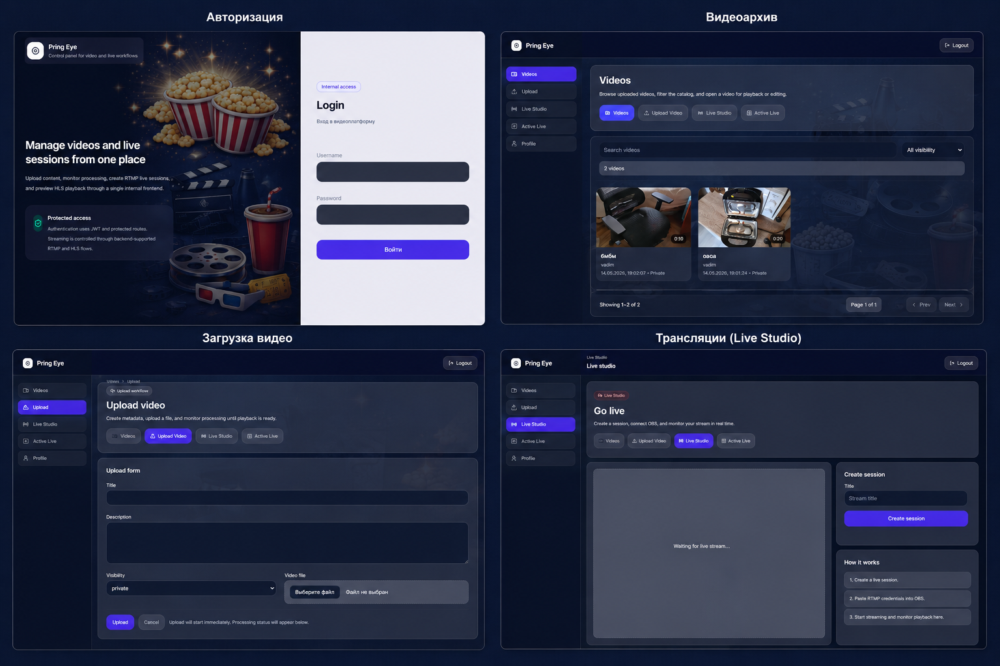

# Video Platform Web Client

Веб-клиент видеоплатформы, разработанный на Next.js.

Проект является частью микросервисной видеоплатформы и предоставляет пользовательский интерфейс для работы с видеоконтентом и прямыми трансляциями через браузер.

---

## Скриншоты

<p align="center">
  
</p>

---

## Возможности

Пользователь может:

- проходить аутентификацию и работать под своей учётной записью;
- просматривать список загруженных видео;
- загружать новые видеоролики;
- отслеживать статус обработки видео;
- просматривать готовые видеозаписи;
- создавать и управлять прямыми трансляциями;
- просматривать активные трансляции в режиме реального времени;
- получать доступ к личному профилю.

Поддерживается воспроизведение видео по протоколу HLS как для записанного контента (VOD), так и для Live-трансляций.

---

## Архитектура проекта

Веб-клиент является частью общей микросервисной архитектуры и взаимодействует с backend-сервисами через REST API.

Основные сервисы платформы:

- Identity Service — аутентификация и авторизация пользователей;
- Video Service — управление видеозаписями;
- Upload Service — загрузка и обработка файлов;
- Live Service — управление прямыми трансляциями.

Все запросы к сервисам проксируются через Next.js API Gateway.

---

## Технологии

- Next.js
- React
- TypeScript
- Tailwind CSS
- React Query
- Axios
- React Hook Form
- Zod
- hls.js
- Docker

---

## Структура проекта

```text
src/
├── app/          # страницы и маршруты приложения
├── features/     # бизнес-функциональность
├── shared/       # общие компоненты и инфраструктура
```

Основные модули:

- auth — аутентификация пользователей;
- videos — работа с видеозаписями;
- upload — загрузка файлов;
- live — управление прямыми трансляциями;
- shared/api — взаимодействие с backend API;
- shared/ui — переиспользуемые компоненты интерфейса.

---

## Запуск проекта

### Требования

- Node.js 20+
- npm

### Установка зависимостей

```bash
npm install
```

### Запуск в режиме разработки

```bash
npm run dev
```

После запуска приложение будет доступно по адресу:

```text
http://localhost:3000
```

### Production-сборка

```bash
npm run build
npm run start
```

### Запуск в Docker

```bash
docker-compose up --build
```

После запуска приложение будет доступно по адресу:

```text
http://localhost:3001
```

---

## Поддерживаемые браузеры

- Google Chrome
- Mozilla Firefox
- Microsoft Edge
- Safari

---

## Связанные проекты

- Video Platform Backend (FastAPI)
- Video Platform Mobile (Flutter)

---

## Статус проекта

Текущий статус: MVP.

Реализованы основные функции платформы:

- загрузка видео;
- обработка видео;
- воспроизведение видеоконтента;
- прямые трансляции;
- аутентификация пользователей.